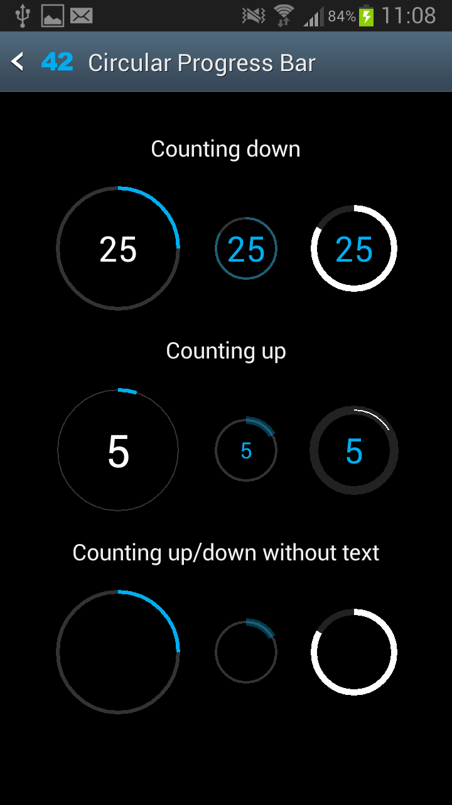
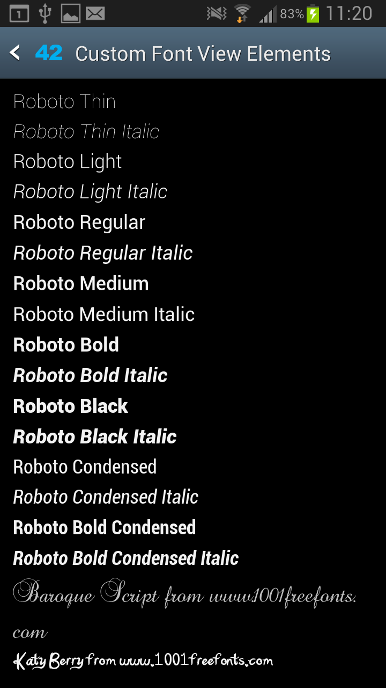

AndroidViewUtils
================

A collection of UI elements and supporting code to ease Android UI implementation

#### [Download Sample App](https://github.com/Sage42/AndroidViewUtils/raw/master/sample_apk/AndroidViewUtilsSamples.apk)

Includes:
--------

### Circular Progress Bar

Just like a normal progress bar only in circle form.  This is ideal for count down timers

* [Code](https://github.com/Sage42/AndroidViewUtils/blob/master/library/src/main/java/com/sage42/android/view/CircularProgressBar.java)
* [Sample (Java)](https://github.com/Sage42/AndroidViewUtils/blob/master/samples/src/main/java/com/sage42/android/view_samples/circular_pb/CircularProgressBarActivity.java)
* [Sample (Layout)](https://github.com/Sage42/AndroidViewUtils/blob/master/samples/res/layout/circular_progress_bar_activity.xml)

### Custom Font Enabled View Elements 

Standard Android View Elements that can be used with custom fonts and a custom font manager. 

Included are the official Roboto fonts so that you have Roboto on older Android versions.
Not all of the UI elements have been enabled yet, so if there is something you need that is missing please submit a ticket or pull request.

* [Code - Button](https://github.com/Sage42/AndroidViewUtils/tree/master/library/src/main/java/com/sage42/android/view/MyButton.java)
* [Code - EditText](https://github.com/Sage42/AndroidViewUtils/tree/master/library/src/main/java/com/sage42/android/view/EditText.java)
* [Code - ViewText](https://github.com/Sage42/AndroidViewUtils/tree/master/library/src/main/java/com/sage42/android/view/ViewText.java)
* [Sample (Java)](https://github.com/Sage42/AndroidViewUtils/tree/master/samples/src/main/java/com/sage42/android/view_samples/custom_fonts/)
* [Sample (Layout)](https://github.com/Sage42/AndroidViewUtils/blob/master/samples/res/layout/custom_fonts_activity.xml)

### Scrolling (Marquee) TextView 

A custom font enabled TextView that is preconfigured to scroll or marquee the content when the size of the content exceeds the space available.

* [Code](https://github.com/Sage42/AndroidViewUtils/blob/master/library/src/main/java/com/sage42/android/view/MyScrollingTextView.java)
* [Sample (Java)](https://github.com/Sage42/AndroidViewUtils/blob/master/samples/src/main/java/com/sage42/android/view_samples/marquee/MarqueeTextActivity.java)
* [Sample (Layout)](https://github.com/Sage42/AndroidViewUtils/blob/master/samples/res/layout/marquee_text_activity.xml)

Contributing
------------

Questions, comments and abuse are all welcome.

Please use the Github Issues, Pull-requests or contact the author(s) via Google+

Author(s):
----------
[Corey Scott](http://plus.google.com/115297926907967777909)

License
-------

    Licensed under the Apache License, Version 2.0 (the "License");
    you may not use this file except in compliance with the License.
    You may obtain a copy of the License at

       http://www.apache.org/licenses/LICENSE-2.0

    Unless required by applicable law or agreed to in writing, software
    distributed under the License is distributed on an "AS IS" BASIS,
    WITHOUT WARRANTIES OR CONDITIONS OF ANY KIND, either express or implied.
    See the License for the specific language governing permissions and
    limitations under the License.
